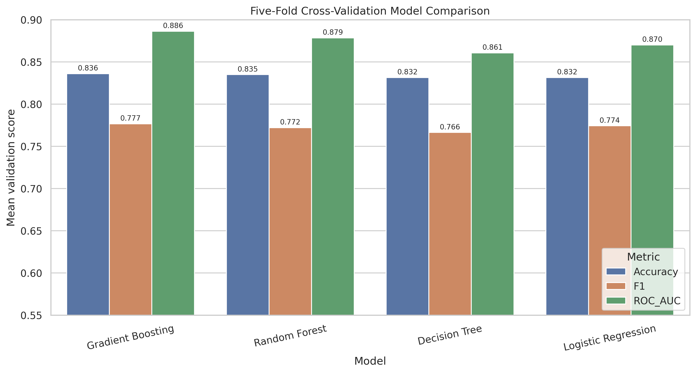
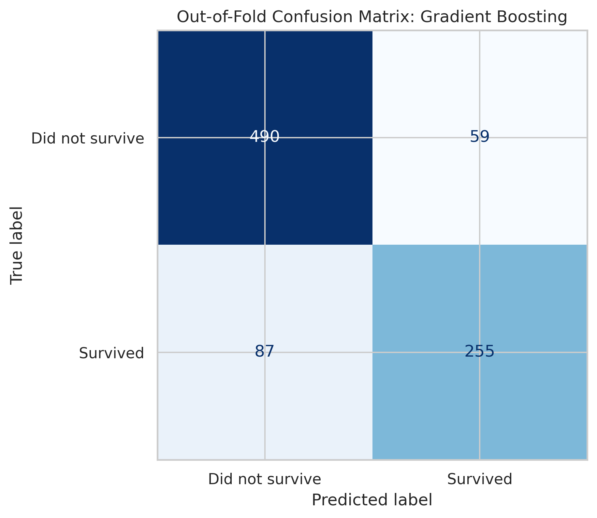
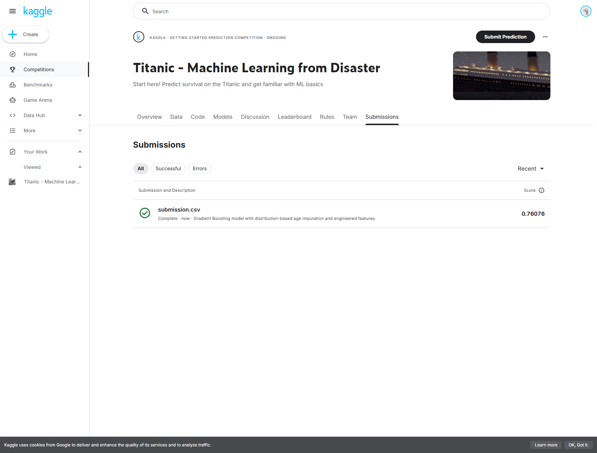

# Assignment 1: End-to-End Data Science with an AI Coding Assistant

**Student:** Weihao Fu  
**Dataset:** Kaggle Titanic – Machine Learning from Disaster  
**AI coding assistant:** ChatGPT / Codex  
**Part 1 status:** Completed  
**Kaggle public score:** **0.76076**

## Project Overview

This project demonstrates an end-to-end data science workflow using the Kaggle Titanic dataset. The objective is to predict whether a passenger survived based on demographic and travel information. An AI coding assistant was used throughout the project to support data inspection, data cleaning, exploratory data analysis, feature engineering, model comparison, evaluation, and Kaggle submission generation.

The project follows these stages:

1. Understand the problem and inspect the dataset.
2. Clean missing and inconsistent values.
3. Perform exploratory data analysis.
4. Engineer additional predictive features.
5. Train and compare machine-learning models.
6. Evaluate the best model using cross-validation.
7. Generate and upload a Kaggle submission.
8. Interpret and communicate the results.

## Dataset

The project uses the three files provided by the Kaggle Titanic competition:

- `train.csv`: 891 passengers with known survival outcomes.
- `test.csv`: 418 passengers whose outcomes must be predicted.
- `gender_submission.csv`: an example of Kaggle's required submission format.

The target variable is `Survived`, where `0` means the passenger did not survive and `1` means the passenger survived.

## Data Cleaning

The original training data contained missing values in `Age`, `Cabin`, and `Embarked`. The test data also contained missing values in `Age`, `Cabin`, and `Fare`.

Missing ages were not replaced with one median value. Instead, each missing age was imputed using the observed training-age distribution conditional on passenger sex and class. The process first sampled an age stage—Child, Teen, Young Adult, Adult, or Senior—using the corresponding distribution and then sampled an observed age from that stage. Fixed random seeds were used so the results are reproducible.

Other cleaning decisions included:

- Missing `Embarked` values were replaced with the training mode.
- Missing `Fare` values were replaced with the training median.
- Missing cabin information was represented using the `CabinKnown` indicator.

## Exploratory Data Analysis

EDA showed strong differences in survival by sex, passenger class, fare, age group, and embarkation port.

- Female survival rate: **74.20%**
- Male survival rate: **18.89%**
- First-class survival rate: **62.96%**
- Third-class survival rate: **24.24%**
- Highest fare quartile survival rate: **58.11%**
- Lowest fare quartile survival rate: **19.73%**
- Child survival rate: **52.94%**
- Senior survival rate: **24.14%**


The results suggest that sex, passenger class, and fare were particularly important predictors. Embarkation port was also associated with survival, although this relationship may partly reflect differences in class and fare.

## Feature Engineering

The following features were created:

| Feature | Definition | Purpose |
|---|---|---|
| `FamilySize` | `SibSp + Parch + 1` | Represents the total number of family members traveling together. |
| `IsAlone` | 1 when `FamilySize = 1` | Identifies passengers traveling alone. |
| `Title` | Extracted from passenger name | Represents social title as Mr, Mrs, Miss, Master, or Rare. |
| `CabinKnown` | 1 when cabin data exists | Indicates whether cabin information was recorded. |
| `TicketGroupSize` | Count of passengers sharing a ticket | Estimates the passenger's traveling group size. |
| `FarePerPerson` | `Fare / TicketGroupSize` | Estimates the fare paid per person. |
| `AgeGroup` | Five age stages | Provides an interpretable age category. |

## Model Training and Evaluation

Four classification models were evaluated using five-fold stratified cross-validation. Every model used the same folds and preprocessing pipeline so that the comparison was fair.

| Model | Mean Accuracy | F1 Score | ROC-AUC |
|---|---:|---:|---:|
| Gradient Boosting | **0.8361** | **0.7768** | **0.8864** |
| Random Forest | 0.8350 | 0.7723 | 0.8786 |
| Decision Tree | 0.8316 | 0.7665 | 0.8607 |
| Logistic Regression | 0.8316 | 0.7744 | 0.8701 |

Gradient Boosting was selected as the final model because it achieved the highest mean validation accuracy and ROC-AUC score.



The out-of-fold predictions correctly classified 745 of the 891 training passengers. The model correctly predicted 490 non-survivors and 255 survivors.



## Kaggle Submission Result

The trained Gradient Boosting model generated predictions for all 418 test passengers. The final `submission.csv` passed checks for column names, passenger order, unique identifiers, missing values, and binary predictions.

The submission received a Kaggle public score of **0.76076**, meaning approximately 76.08% of the public test cases were predicted correctly. This was lower than the cross-validation accuracy of 83.61%, which suggests some reduction in generalization performance on unseen competition data.



## Project Structure

```text
titanic_assignment/
├── README.md
├── requirements.txt
└── part1/
    ├── data/
    │   ├── train.csv
    │   ├── test.csv
    │   └── gender_submission.csv
    ├── images/
    ├── models/
    ├── results/
    ├── step4_eda.py
    ├── step5_feature_engineering.py
    ├── step6_model_training.py
    └── step7_generate_submission.py
```

## How to Run the Project

Create a Python environment and install the dependencies:

```bash
pip install -r requirements.txt
```

Run the scripts from the repository root in this order:

```bash
python part1/step4_eda.py
python part1/step5_feature_engineering.py
python part1/step6_model_training.py
python part1/step7_generate_submission.py
```

The final Kaggle submission will be saved as `part1/results/submission.csv`.

## Interpretation

The analysis indicates that Titanic survival was strongly associated with sex and socioeconomic status. Female passengers and first-class passengers had substantially higher survival rates. Higher fares were also associated with higher survival. Family and ticket-group features provided additional information about each passenger's travel context.

Gradient Boosting performed slightly better than the other models during cross-validation. However, its lower Kaggle score shows why evaluation on truly unseen data is necessary. A model that performs well during cross-validation may still lose accuracy when the test population differs from the training folds.

## Limitations and Possible Improvements

- Distribution-based age imputation preserves age-group proportions but still introduces sampled values.
- The model was compared using a limited hyperparameter search.
- Cabin deck information could be extracted in more detail.
- Family surnames and shared-ticket relationships could be modeled further.
- Nested cross-validation or systematic hyperparameter optimization could provide a more robust model selection process.

## AI-Assisted Workflow Reflection

The AI coding assistant helped convert the project requirements into a reproducible workflow, generate and debug Python code, explain statistical results, and organize the final artifacts. I reviewed the proposed methods and requested a revision to the original age-imputation approach because replacing every missing age with 28 would artificially increase that age group. This interaction demonstrated that AI-generated solutions should be inspected critically rather than accepted automatically.

The most important lesson from this project is that an end-to-end data science task involves more than training a model. Data quality, feature definitions, fair evaluation, reproducibility, and clear communication all affect the final result.

## Required Presentation Links

- Medium article: **To be added**
- YouTube end-to-end walkthrough: **To be added**

## Part 2: Data Science Experiment Reproduction

The first Part 2 experiment reproduces the instructor's customer clustering example using the public Mall Customer Segmentation dataset.

- [Customer Segmentation Using K-Means Clustering](part2/customer_segmentation/README.md)
- Selected clusters: **5**
- Silhouette score: **0.5547**
- YouTube Part 2 walkthrough: **To be added after recording**

## Acknowledgments

- Dataset: Kaggle, *Titanic – Machine Learning from Disaster*
- Workflow support: ChatGPT / Codex
