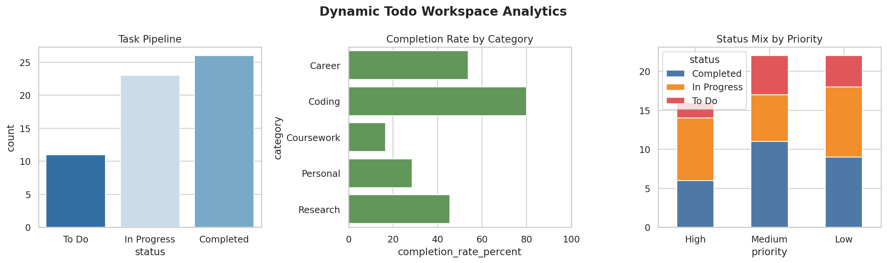

# Experiment 00 — Dynamic Todo Workspace

**Author:** Weihao Fu  
**Course:** CMPE 255 Assignment 1, Part 2

## Objective

This lightweight reproduction turns a task workspace into a reproducible analytics experiment. It creates 60 deterministic sample tasks, tracks category, priority, status, dates, and estimated effort, and generates a management dashboard and summary tables.

## Workflow

1. Generate a fixed sample workspace with `random_state=42`.
2. Validate and store the task table in `data/tasks.csv`.
3. Calculate completion rate, estimated effort, and completion time.
4. Compare task performance by category and priority.
5. Export a dashboard and machine-readable results.

## Results

The exact reproducible results are stored in `results/workspace_summary.json`, `category_summary.csv`, and `priority_status.csv`.



## Run

```bash
python part2/00_dynamic_todo_workspace/run_experiment.py
```

## Interpretation

The dashboard provides a compact view of workflow health: the size of the current pipeline, category-level completion rates, and whether high-priority work is being completed. A real implementation could replace the sample CSV with records from a task application or database.

## Video Talking Points

- Explain why task data can be analyzed like an operational dataset.
- Show the generated CSV, summary JSON, and dashboard.
- Run the script and explain completion rate versus task count.

## Reference

Simplified from the instructor's `00_dynamic_todo_workspace` example.

