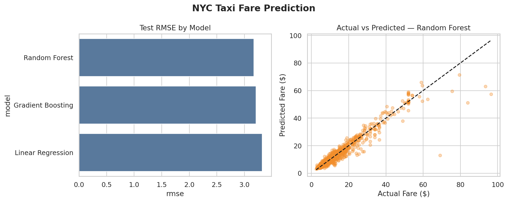

# Experiment 01 — NYC Taxi Trip Prediction

**Author:** Weihao Fu

## Objective

This experiment predicts NYC taxi fare from trip distance, passenger count, pickup time, day of week, and pickup/drop-off boroughs. It is a compact reproduction of the instructor's larger taxi prediction platform.

## Dataset

The project uses the public [Seaborn NYC taxis dataset](https://github.com/mwaskom/seaborn-data/blob/master/taxis.csv). The included CSV contains pickup and drop-off timestamps, passenger count, distance, fare components, payment type, and borough information.

## Method

- Remove missing targets and invalid trips.
- Derive pickup hour and day of week.
- Median-impute and standardize numeric features.
- Impute and one-hot encode borough features.
- Compare Linear Regression, Random Forest, and Gradient Boosting on the same 80/20 split.
- Select the model with the lowest test RMSE.

## Evaluation

The experiment reports MAE, RMSE, and R². Exact values are generated in `results/model_comparison.csv` and summarized in `experiment_summary.json`.



## Run

```bash
python part2/01_nyc_taxi_trip_prediction/run_experiment.py
```

## Limitations

This is an educational sample rather than the complete NYC TLC dataset. Random train/test splitting does not measure future temporal drift, and the model should not be used to set real fares.

## Video Talking Points

- Explain the target and engineered time features.
- Compare MAE, RMSE, and R².
- Interpret the diagonal actual-versus-predicted plot.
