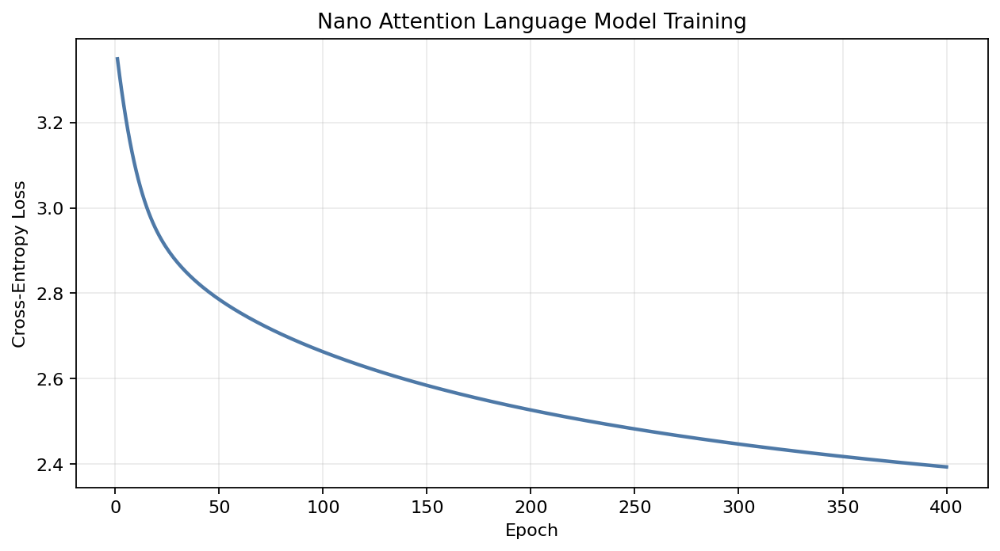

# Experiment 02 — Nano LLM with Causal Self-Attention

**Author:** Weihao Fu

## Objective

This educational experiment reproduces the main ideas of the instructor's Nano LLM example in a CPU-friendly NumPy implementation. It tokenizes text at the character level, builds causal self-attention representations, trains a next-character output projection, tracks cross-entropy loss, and generates new text autoregressively.

## Architecture

- Character vocabulary and embeddings
- Learned positional embeddings
- One masked self-attention head using query, key, and value matrices
- Residual combination of token and attention representations
- Trained softmax output projection
- Autoregressive sampling with temperature

Only the output projection is optimized in this lightweight reproduction; the attention representation is fixed after seeded initialization. It is therefore a teaching model, not a production LLM or a fully trained Transformer.

## Results

Training history is in `results/training_history.csv`, generated text is in `generated_text.txt`, and all weights are stored in `models/nano_attention_model.npz`.



## Run

```bash
python part2/02_nano_llm_transformer/run_experiment.py
```

## Interpretation and Limitations

A falling cross-entropy loss shows that the output layer learned character patterns in the small corpus. Generated text should only be evaluated as a demonstration of next-token sampling. The corpus is tiny, the attention weights are not optimized, and coherent long-form language is not expected.

## Video Talking Points

- Explain character tokenization and causal masking.
- Show the loss curve and generated sample.
- Clearly distinguish this teaching model from a large language model.

