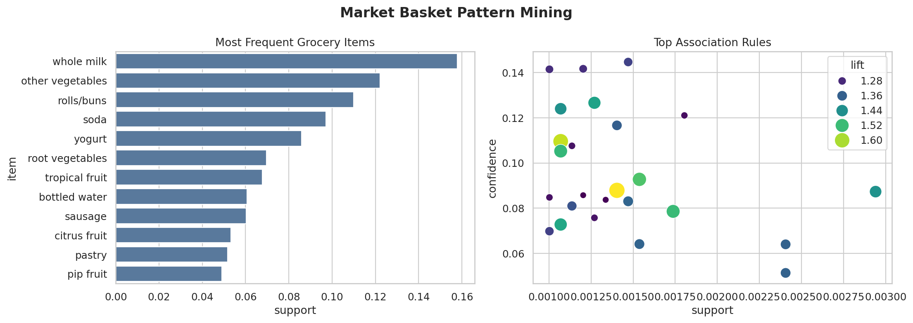

# Experiment 04 — Associative Pattern Mining

**Author:** Weihao Fu

## Objective

This experiment analyzes grocery baskets to find items that frequently occur together and directional association rules. It reproduces the core ideas of Apriori-style market basket analysis using transparent Python counting logic.

## Dataset

`Groceries_dataset.csv` contains member, date, and item records. A transaction is defined as all unique items purchased by the same member on the same date. The included public dataset was retrieved from a [GitHub mirror of the Groceries dataset](https://github.com/leobasaeff-netizen/Groceries_dataset).

## Metrics

- **Support:** proportion of transactions containing the item pair.
- **Confidence:** probability of the consequent given the antecedent.
- **Lift:** confidence divided by the consequent's baseline support. Lift above 1 indicates positive association.

The experiment uses minimum support `0.001` and minimum confidence `0.05`, then ranks rules by lift.



## Run

```bash
python part2/04_associative_pattern_mining/run_experiment.py
```

## Outputs

- `item_support.csv`: individual item frequency
- `frequent_pairs.csv`: qualifying two-item sets
- `association_rules.csv`: directional support, confidence, and lift
- `experiment_summary.json`: compact run summary

## Limitations

Association does not prove causation. Rare rules can have high lift, and the analysis does not include quantity, price, or product placement. This simplified implementation mines pairs rather than all larger itemsets.

## Video Talking Points

- Explain how rows become shopping baskets.
- Define support, confidence, and lift.
- Show the top-item chart and rule scatterplot.
