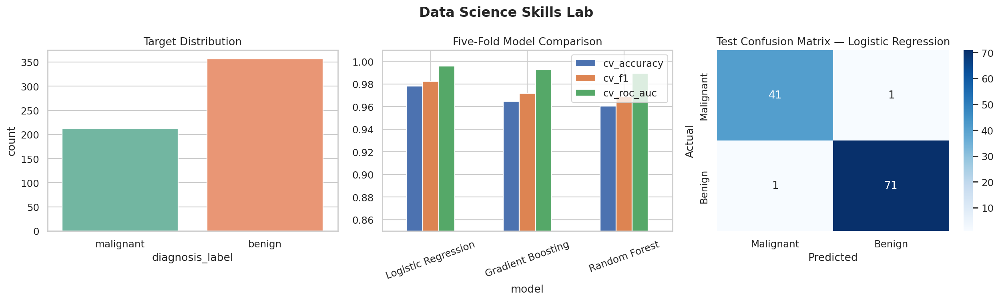
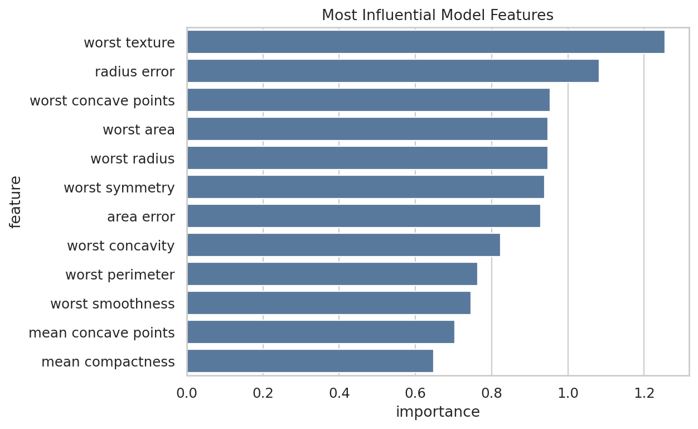

# Experiment 05 — Data Science Skills Lab

**Author:** Weihao Fu

## Objective

This compact skills lab demonstrates a complete classification workflow: dataset acquisition, validation, exploratory analysis, stratified splitting, preprocessing, cross-validation, model comparison, test evaluation, feature interpretation, model persistence, and communication.

## Dataset

The experiment uses scikit-learn's public Breast Cancer Wisconsin Diagnostic dataset: 569 observations, 30 numeric features, and a binary benign/malignant target. A CSV copy is exported to `data/` for inspection and reproducibility.

## Models and Evaluation

- Logistic Regression with standardized features
- Random Forest
- Gradient Boosting

Models use the same five stratified folds and are compared with accuracy, F1, and ROC-AUC. The highest cross-validation ROC-AUC model is fitted on the training split and evaluated once on the held-out test split.





## Run

```bash
python part2/05_data_science_skills_lab/run_experiment.py
```

## Reproducible Outputs

- Cross-validation comparison
- Held-out confusion matrix
- Feature-importance table
- Experiment summary JSON
- Saved best model
- Two presentation-ready charts

## Responsible Interpretation

This dataset is suitable for learning but does not make the model a clinical diagnostic system. Cross-validation reduces dependence on one split, but external validation, calibration, subgroup evaluation, and clinical review would be required for medical use.

## Video Talking Points

- Walk through the end-to-end data science stages.
- Explain why stratification and cross-validation matter.
- Distinguish validation metrics from final test metrics.
- State the medical-use limitation clearly.

