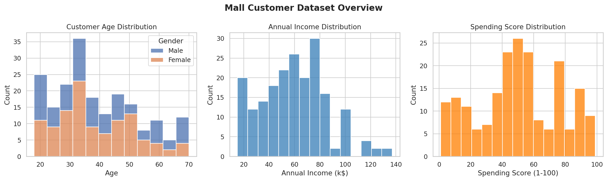
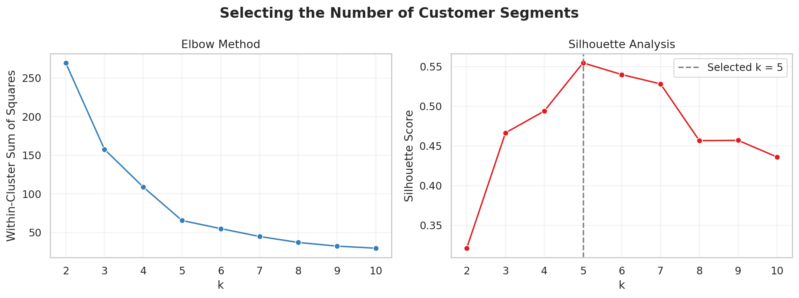
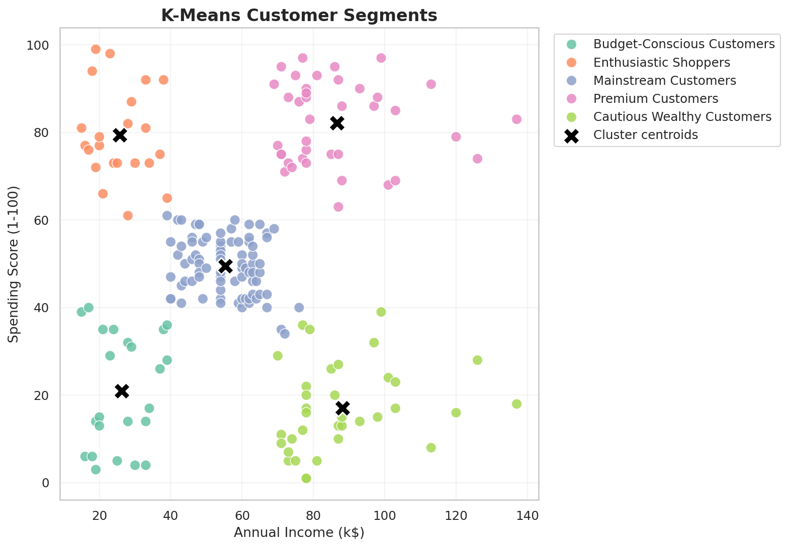
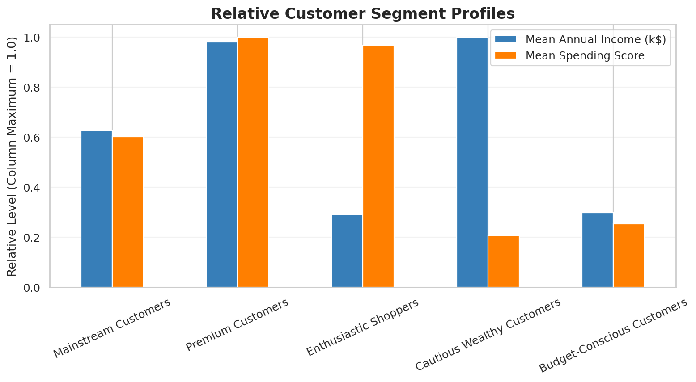

# Customer Segmentation Using K-Means Clustering

**Author:** Weihao Fu  
**Course:** CMPE 255 — Assignment 1, Part 2  
**AI coding assistant:** ChatGPT / Codex

## Project Overview

This project reproduces the core customer-clustering workflow from the instructor's data science examples in a smaller, fully reproducible experiment. It uses K-Means clustering to group mall customers according to annual income and spending score. The workflow includes data validation, exploratory data analysis, feature scaling, model selection, multi-metric evaluation, customer profiling, visualization, and model persistence.

Because clustering is unsupervised, there is no target label or classification accuracy. Model quality is evaluated with the silhouette coefficient, Davies–Bouldin index, and Calinski–Harabasz score.

## Dataset

The experiment uses the public Mall Customer Segmentation dataset with 200 customer records and five columns:

| Column | Description |
|---|---|
| `CustomerID` | Unique customer identifier |
| `Genre` | Gender in the original source file; renamed to `Gender` in the analysis |
| `Age` | Customer age in years |
| `Annual Income (k$)` | Annual income in thousands of dollars |
| `Spending Score (1-100)` | Mall-assigned spending behavior score |

The CSV is included in `data/Mall_Customers.csv` so the experiment can run without a Kaggle account. The dataset is commonly distributed through Kaggle's Mall Customer Segmentation datasets; the included copy was retrieved from a [public GitHub mirror](https://github.com/tanishq21/Mall-Customers).

## Methodology

1. Load the CSV and validate the required columns and missing values.
2. Explore age, annual income, and spending-score distributions.
3. Select annual income and spending score as the clustering features.
4. Standardize both features with `StandardScaler` so their scales contribute fairly.
5. Train K-Means models for `k=2` through `k=10` using 20 initializations and `random_state=42`.
6. Select the model with the highest silhouette score.
7. Evaluate the selected model using three internal clustering metrics.
8. Convert cluster IDs into interpretable business segment names.
9. Save the assignments, profiles, metrics, charts, and fitted pipeline.

## Exploratory Data Analysis

The dataset contains customers from age 18 to 70, annual incomes from 15k to 137k dollars, and spending scores from 1 to 99. Income and spending score reveal clearer behavioral groups than age alone, so they are used as the two model features.



## Selecting the Number of Clusters

The elbow curve shows how within-cluster variation decreases as more clusters are added. The silhouette score additionally measures how compact and separated the clusters are. Among the tested values, `k=5` produced the highest silhouette score and was selected automatically.



## Experiment Results

| Metric | Result | Interpretation |
|---|---:|---|
| Selected clusters | **5** | Five customer groups provided the best tested separation. |
| Silhouette score | **0.5547** | The groups have reasonably clear separation and internal cohesion. |
| Davies–Bouldin index | **0.5722** | Lower values are better; this indicates relatively distinct clusters. |
| Calinski–Harabasz score | **248.65** | Higher values indicate stronger between-cluster separation relative to within-cluster variation. |

The exact metrics for every tested value of `k` are saved in `results/k_evaluation.csv`.

## Customer Segment Profiles

| Segment | Customers | Share | Mean Age | Mean Income (k$) | Mean Spending Score |
|---|---:|---:|---:|---:|---:|
| Mainstream Customers | 81 | 40.5% | 42.72 | 55.30 | 49.52 |
| Premium Customers | 39 | 19.5% | 32.69 | 86.54 | 82.13 |
| Enthusiastic Shoppers | 22 | 11.0% | 25.27 | 25.73 | 79.36 |
| Cautious Wealthy Customers | 35 | 17.5% | 41.11 | 88.20 | 17.11 |
| Budget-Conscious Customers | 23 | 11.5% | 45.22 | 26.30 | 20.91 |





## Business Interpretation

- **Premium Customers** combine high income with high spending and are strong candidates for loyalty rewards, premium services, and early product access.
- **Cautious Wealthy Customers** have high income but low spending. Personalized offers or stronger value messaging may increase engagement.
- **Enthusiastic Shoppers** spend actively despite lower income. Affordable bundles and frequent-shopper rewards may fit this segment.
- **Budget-Conscious Customers** have both lower income and lower spending. Price-sensitive promotions are more appropriate than premium campaigns.
- **Mainstream Customers** form the largest group and remain near the middle of both features. Broad campaigns and cross-selling tests may be suitable.

These names are descriptive interpretations of cluster averages, not objective facts about individual customers.

## Project Structure

```text
part2/customer_segmentation/
├── README.md
├── VIDEO_SCRIPT.md
├── run_experiment.py
├── data/
│   └── Mall_Customers.csv
├── images/
│   ├── cluster_profiles.png
│   ├── customer_segments.png
│   ├── eda_overview.png
│   └── elbow_silhouette.png
├── models/
│   └── kmeans_pipeline.joblib
└── results/
    ├── cluster_profiles.csv
    ├── customer_segments.csv
    ├── experiment_summary.json
    └── k_evaluation.csv
```

## How to Run

From the repository root, install the dependencies and run the experiment:

```bash
pip install -r requirements.txt
python part2/customer_segmentation/run_experiment.py
```

The script recreates all files in the `images`, `models`, and `results` directories. A successful run prints the selected metrics and customer profiles in the terminal.

## Reproducibility

- Python dependencies are pinned in the repository-level `requirements.txt`.
- K-Means uses `random_state=42` and `n_init=20`.
- The model is selected by a documented metric rather than a manually chosen result.
- The saved `Pipeline` contains both the fitted scaler and K-Means model, preventing inconsistent preprocessing during later use.

## Limitations and Possible Improvements

- The dataset is small and represents only 200 mall customers.
- The spending score is already a constructed business measure, but its exact calculation is not documented.
- K-Means assumes roughly spherical clusters and uses Euclidean distance.
- The current model uses only income and spending score for clarity and easy visualization.
- Future work could compare Gaussian Mixture Models, hierarchical clustering, and stability under resampling.

## AI-Assisted Workflow Reflection

ChatGPT / Codex was used to inspect the instructor's example, design a simplified experiment, implement the Python workflow, run it, validate the generated artifacts, and organize the results. I reviewed the selected features, metrics, cluster profiles, and business interpretations. The exercise shows that AI can accelerate implementation, but the student must still verify that the code runs and that the interpretation is supported by the results.

## Video Walkthrough

- YouTube demonstration: **To be added after recording**
- A short recording outline is provided in [`VIDEO_SCRIPT.md`](VIDEO_SCRIPT.md).

## Acknowledgments

- Instructor example: [dlmastery/data_science_examples](https://github.com/dlmastery/data_science_examples/tree/main/03_customer_segmentation_clustering)
- Dataset source: Mall Customer Segmentation dataset, with the included CSV retrieved from a [public mirror](https://github.com/tanishq21/Mall-Customers)
- Workflow support: ChatGPT / Codex

